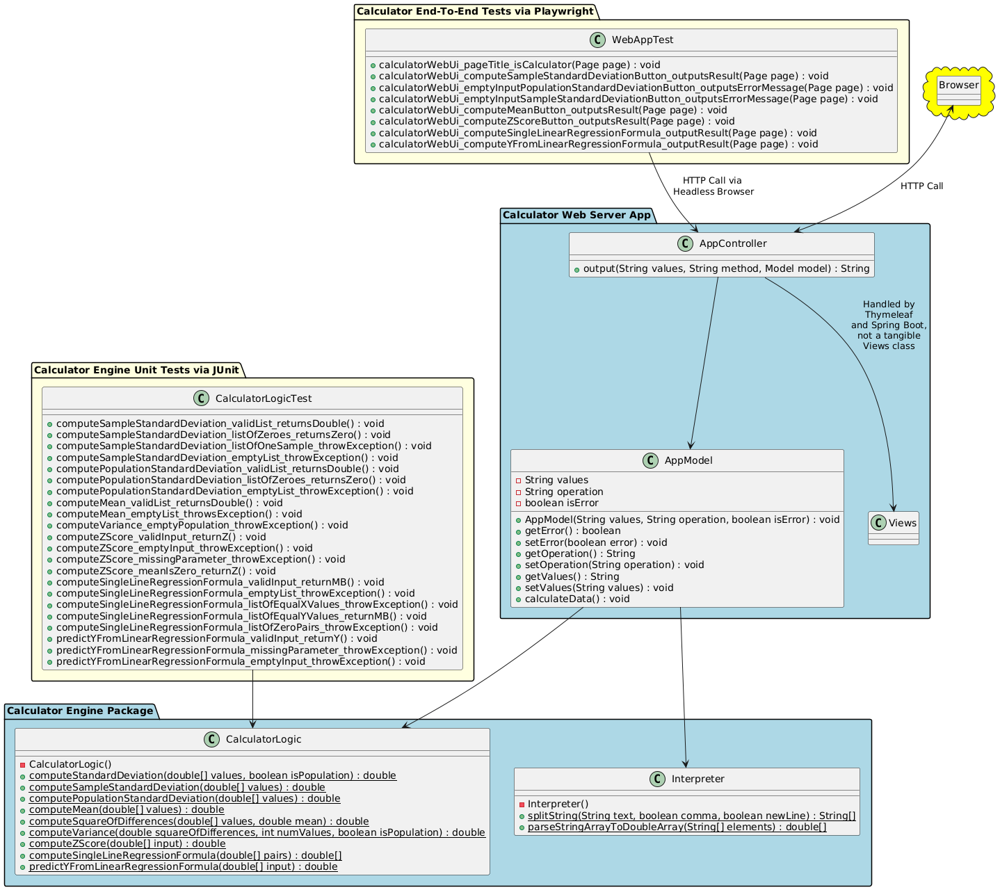
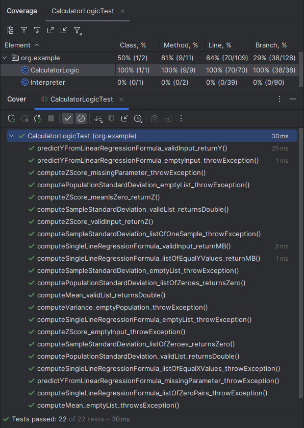

# KSU SWE 3643 Software Testing and Quality Assurance Semester Project: Web-Based Calculator
As a part of my class, I was given the task to design, create, and test a project to showcase software quality assurance measures learned during the past semester. This repository expresses the culmination of said knowledge through a web calculator that features the ability to calculate deviations and single line regression formulas amongst other calculations. It also describes step-by-step as to how to run the web application, unit tests for its logic, and end-to-end web tests amongst other things, as well as providing imagery to assist in understanding the contents of this project.

## Table of Contents

- [Team Members](#team-members)
- [Architecture](#architecture)
- [Environment](#environment)
- [Executing the Web Application](#executing-the-web-application)
- [Executing Unit Tests](#executing-unit-tests)
- [Reviewing Unit Test Coverage](#reviewing-unit-test-coverage)
- [Executing End-To-End Tests](#executing-end-to-end-tests)
- [Final Video Presentation](#final-video-presentation)

## Team Members
This entire project was completed in its entirety by myself, Eduardo Arellano, to practice my knowledge of quality assurance, Java, and HTML as well as enlightening myself about powerful tools, such as Maven and POM files.

## Architecture
The structure of the web app is split into four distinct modules, linked by a parent POM with some dependencies formed between submodules. These submodules consist of the logic, unit tests, web page, and end-to-end tests, where the web page and unit tests rely on logic, while the end-to-end tests rely on the web page. The web page itself takes on a Model, View, and Controller architecture; Views are handled by Thymeleaf through the Controller and the Model and Controller share a symbiotic relationship as well. The Model itself refers to the logic module's ability to translate inputs and perform computations that then returns back to the Controller. To give a better idea of the format of this project, here is a PlantUML generated diagram showcasing its inner-workings:



## Environment
This is a cross-platform application and should work in Windows 10+, Mac OSx Ventura+, and Linux environments. Note that the application has only been carefully tested in Windows 10 and Windows 11.

To prepare your environment to execute this application:
 1. [Install the latest Java Development Kit for your system.](https://www.oracle.com/java/technologies/downloads/) This project utilized JDK 21 during development, so using this or a newer version will produce the best result when running this application.
 2. [Install the latest Maven software project management and comprehension tool.](https://maven.apache.org/download.cgi) Dependency management was covered with Maven 3.9.9 in mind.

Playwright itself is already managed by Maven through POM files, so there should be no need to configure it for end-to-end testing. Though, it is worth noting that this project starts up HTTP port 8080, so if there is already something on port 8080, running this application will not work and will instead result in some errors.

## Executing the Web Application
After setting up the environment for this project, the web application should now be runnable from the command line in the /src/ folder.
 1. From the command line (terminal / console), enter the directory of the project's /src/ folder. Do so by doing:
```bash
$ cd <directory containing project folder>/swe3643-fall2024-project/src
```
 2. Next, start up spring-boot through the Maven command. Execute the command from the /src/ folder:
```bash
$ mvn spring-boot:run -pl web
```

 Note: As previously mentioned, if port 8080 is already occupied, running the project will fail, so make sure the port is vacant and rerun the command mentioned in step 3 in /src/ to retry.
 
The web application should now be running from the command line and should be accessible from the localhost site [http://localhost:8080](http://localhost:8080).

## Executing Unit Tests
To execute unit tests for the application's calculator logic, it can easily be run from the command line. Simply run the following Maven command in the /src/ folder:
```bash
$ mvn test -pl tests
```

From here, the tests should run and all should pass. Here is some sample output that would come from running the tests:
```bash
$ mvn test -pl tests

[INFO] Scanning for projects...
[INFO] 
[INFO] -------------< org.example:swe3643-fall2024-project-tests >-------------
[INFO] Building swe3643-fall2024-project-tests-1.0-SNAPSHOT 1.0-SNAPSHOT
[INFO]   from pom.xml
[INFO] --------------------------------[ jar ]---------------------------------
[INFO] 
[INFO] --- resources:3.3.1:resources (default-resources) @ swe3643-fall2024-project-tests ---
[INFO] skip non existing resourceDirectory \swe3643-fall2024-project\src\tests\src\main\resources
[INFO] 
[INFO] --- compiler:3.13.0:compile (default-compile) @ swe3643-fall2024-project-tests ---
[INFO] No sources to compile
[INFO] 
[INFO] --- resources:3.3.1:testResources (default-testResources) @ swe3643-fall2024-project-tests ---
[INFO] skip non existing resourceDirectory \swe3643-fall2024-project\src\tests\src\test\resources
[INFO] 
[INFO] --- compiler:3.13.0:testCompile (default-testCompile) @ swe3643-fall2024-project-tests ---
[INFO] Nothing to compile - all classes are up to date.
[INFO] 
[INFO] --- surefire:3.2.5:test (default-test) @ swe3643-fall2024-project-tests ---
[INFO] Using auto detected provider org.apache.maven.surefire.junitplatform.JUnitPlatformProvider
[INFO] 
[INFO] -------------------------------------------------------
[INFO]  T E S T S
[INFO] -------------------------------------------------------
[INFO] Running org.example.CalculatorLogicTest
[INFO] Tests run: 22, Failures: 0, Errors: 0, Skipped: 0, Time elapsed: 0.086 s -- in org.example.CalculatorLogicTest
```

## Reviewing Unit Test Coverage
Throughout the entirety of development, unit tests were designed with the primary focus to ensure that all statements and paths of the app's logic is fully tested and successful. Through the use of JetBrains' IDE coverage graphic tool, it has produced the following results regarding the app's logic:



## Executing End-To-End Tests
As mentioned earlier, Maven manages Playwright, so there's no need to manually configure the project for it to work. In addition, the end-to-end tests start the web app then ends it when its finished running, so its just as easy to run them as the unit tests, just run the following command in the /src/ folder:
```bash
$ mvn test -pl e2e
```
The end-to-end tests should then execute and succeed, and for reference here is a sample output from running the tests:
```bash
$ mvn test -pl e2e

[INFO] Scanning for projects...
[INFO] 
[INFO] --------------< org.example:swe3643-fall2024-project-e2e >--------------    
[INFO] Building swe3643-fall2024-project-e2e-1.0-SNAPSHOT 1.0-SNAPSHOT
[INFO]   from pom.xml
[INFO] --------------------------------[ jar ]---------------------------------    
[INFO] 
[INFO] --- resources:3.3.1:resources (default-resources) @ swe3643-fall2024-project-e2e ---
[INFO] skip non existing resourceDirectory \swe3643-fall2024-project\src\e2e\src\main\resources
[INFO]
[INFO] --- compiler:3.13.0:compile (default-compile) @ swe3643-fall2024-project-e2e ---
[INFO] No sources to compile
[INFO]
[INFO] --- resources:3.3.1:testResources (default-testResources) @ swe3643-fall2024-project-e2e ---
[INFO] skip non existing resourceDirectory \swe3643-fall2024-project\src\e2e\src\test\resources
[INFO]
[INFO] --- compiler:3.13.0:testCompile (default-testCompile) @ swe3643-fall2024-project-e2e ---
[INFO] Recompiling the module because of changed source code.
[INFO] Compiling 1 source file with javac [debug target 21] to target\test-classes 
[INFO] 
[INFO] --- surefire:3.3.0:test (default-test) @ swe3643-fall2024-project-e2e ---   
[INFO] Using auto detected provider org.apache.maven.surefire.junitplatform.JUnitPlatformProvider
[INFO] 
[INFO] -------------------------------------------------------
[INFO]  T E S T S
[INFO] -------------------------------------------------------
[INFO] Running org.example.WebAppTest
22:13:27.699 [main] INFO org.springframework.test.context.support.AnnotationConfigC
ontextLoaderUtils -- Could not detect default configuration classes for test class 
[org.example.WebAppTest]: WebAppTest does not declare any static, non-private, non-final, nested classes annotated with @Configuration.
22:13:27.931 [main] INFO org.springframework.boot.test.context.SpringBootTestContex
tBootstrapper -- Found @SpringBootConfiguration org.example.Application for test class org.example.WebAppTest

  .   ____          _            __ _ _
 /\\ / ___'_ __ _ _(_)_ __  __ _ \ \ \ \
( ( )\___ | '_ | '_| | '_ \/ _` | \ \ \ \
 \\/  ___)| |_)| | | | | || (_| |  ) ) ) )
  '  |____| .__|_| |_|_| |_\__, | / / / /
 =========|_|==============|___/=/_/_/_/

 :: Spring Boot ::                (v3.3.5)

2024-11-29T22:13:28.740-05:00  INFO 23028 --- [           main] org.example.WebAppT
est                   : Starting WebAppTest using Java 21.0.4 with PID 23028
2024-11-29T22:13:28.743-05:00  INFO 23028 --- [           main] org.example.WebAppT
est                   : No active profile set, falling back to 1 default profile: "default"
2024-11-29T22:13:30.621-05:00  INFO 23028 --- [           main] o.s.b.w.embedded.tomcat.TomcatWebServer  : Tomcat initialized with port 8080 (http)
2024-11-29T22:13:30.649-05:00  INFO 23028 --- [           main] o.apache.catalina.core.StandardEngine    : Starting Servlet engine: [Apache Tomcat/10.1.31]
2024-11-29T22:13:30.779-05:00  INFO 23028 --- [           main] o.a.c.c.C.[Tomcat].[localhost].[/]       : Initializing Spring embedded WebApplicationContext
2024-11-29T22:13:30.781-05:00  INFO 23028 --- [           main] w.s.c.ServletWebServerApplicationContext : Root WebApplicationContext: initialization completed in 1998 ms
2024-11-29T22:13:31.001-05:00  INFO 23028 --- [           main] o.s.b.a.w.s.WelcomePageHandlerMapping    : Adding welcome page template: index
2024-11-29T22:13:32.086-05:00  INFO 23028 --- [           main] o.s.b.w.embedded.tomcat.TomcatWebServer  : Tomcat started on port 8080 (http) with context path '/'
2024-11-29T22:13:32.106-05:00  INFO 23028 --- [           main] org.example.WebAppTest                   : Started WebAppTest in 3.87 seconds (process running for 5.853)
Java HotSpot(TM) 64-Bit Server VM warning: Sharing is only supported for boot loader classes because bootstrap classpath has been appended
2024-11-29T22:13:43.966-05:00  INFO 23028 --- [nio-8080-exec-1] o.a.c.c.C.[Tomcat].[localhost].[/]       : Initializing Spring DispatcherServlet 'dispatcherServlet'
2024-11-29T22:13:43.966-05:00  INFO 23028 --- [nio-8080-exec-1] o.s.web.servlet.DispatcherServlet        : Initializing Servlet 'dispatcherServlet'
2024-11-29T22:13:43.968-05:00  INFO 23028 --- [nio-8080-exec-1] o.s.web.servlet.DispatcherServlet        : Completed initialization in 2 ms
[INFO] Tests run: 8, Failures: 0, Errors: 0, Skipped: 0, Time elapsed: 19.99 s -- in org.example.WebAppTest
```

## Final Video Presentation


