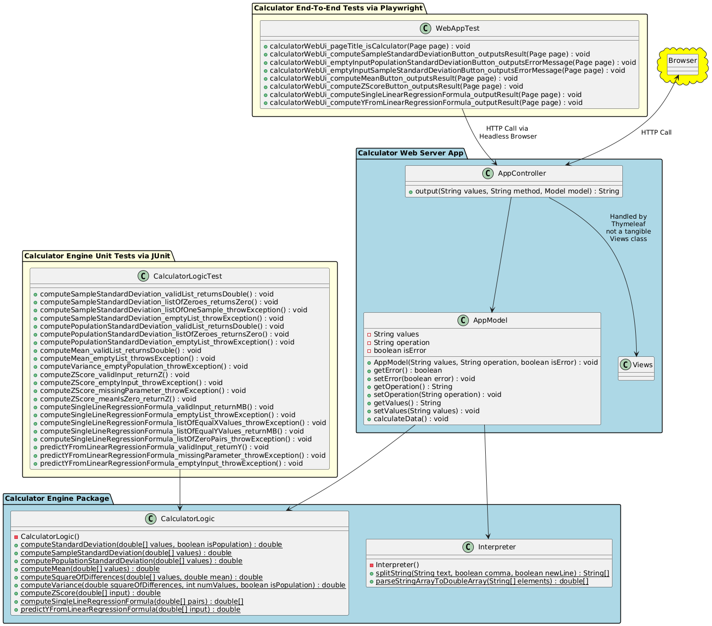
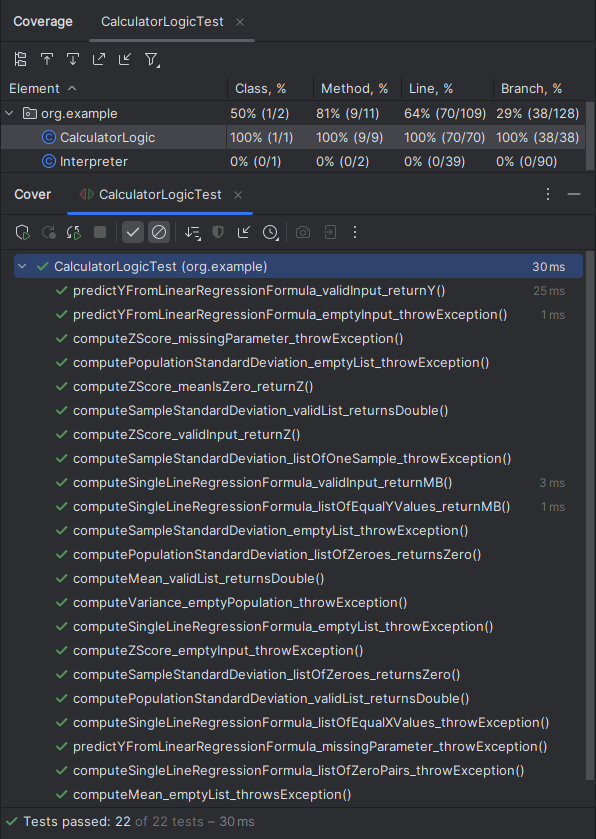

# KSU SWE 3643 Software Testing and Quality Assurance Semester Project: Web-Based Calculator
As a part of my class, I was given the task to design, create, and test a project to showcase software quality assurance measures learned during the past semester. This repository expresses the culmination of said knowledge through a web application designed to calculate deviations and single line regression formulas. It also describes step-by-step as to how to run the web application, unit tests for its logic, and end-to-end web tests amongst other things, as well as providing imagery to assist in understanding the contents of this project.

## Table of Contents

- [Team Members](#team-members)
- [Architecture](#architecture)
- [Environment](#environment)
- [Executing the Web Application](#executing-the-web-application)
- [Executing Unit Tests](#executing-unit-tests)
- [Reviewing Unit Test Coverage](#reviewing-unit-test-coverage)
- [Executing End-To-End Tests](#executing-end-to-end-tests)
- [Final Video Presentation](#final-video-presentation)

## Team Members
This entire project was completed in its entirety by myself, Eduardo Arellano, to practice my knowledge of quality assurance, Java, and HTML as well as enlightening myself about powerful tools, such as Maven and POM files.

## Architecture
To give a idea of the general structure of this project, here is a PlantUML generated diagram showcasing its inner-workings:



## Environment
This is a cross-platform application and should work in Windows 10+, Mac OSx Ventura+, and Linux environments. Note that the application has only been carefully tested in Windows 10 and Windows 11.

To prepare your environment to execute this application:
 1. [Install the latest Java Development Kit for your system.](https://www.oracle.com/java/technologies/downloads/) This project utilized JDK 21 during development, so using this or a newer version will produce the best result when running this application.
 2. [Install the latest Maven software project management and comprehension tool.](https://maven.apache.org/download.cgi) Dependency management is covered with Maven 3.9.9 in mind.

Playwright itself is already managed by Maven through POM files, so there should be no need to configure it for end-to-end testing. Though, it is worth noting that this project starts up HTTP port 8080, so if there is already something on port 8080, running this application will not work and will instead result in some errors.

## Executing the Web Application
After setting up the environment for this project, the web application should now be runnable from the command line, but not before setting up the project itself.
 1. From the command line (terminal / console), enter the directory of the project's /src/ folder. Do so by doing:
```bash
$ cd <directory containing project file>/swe3643-fall2024-project/src
```
 2. Next, download all dependencies and compile all files for the project through Maven. In the /src/ folder run:
```bash
$ mvn clean install
```
 Note: There might be some build failiure which may pop up regarding failed tests for the e2e module, these are safe to ignore.

 3. Lastly, start up spring-boot through the Maven command. Execute the command from the /src/ folder:
```bash
$ mvn spring-boot:run -pl web
```

 Note: As previously mentioned, if port 8080 is already occupied, running the project will fail, so make sure the port is vacant and rerun the command mentioned in step 3 in /src/ to retry.
 
The web application should now be running from the command line and should be accessible from the localhost site [http://localhost:8080](http://localhost:8080).

## Executing Unit Tests
To execute unit tests for the application's calculator logic, it can easily be run from the command line.
 1. If the project has not yet installed all dependencies or compiled its files, do so through the command:
```bash
$ mvn clean install
```
 Note: This command must run in the /src/ folder of the project.
 
2. From the /src/ folder, execute the unit tests through maven. Done through the command:
```bash
$ mvn test -pl tests
```

From here, the tests should run and all unit tests should succeed. Here is some sample output that should come from running the tests:
```bash
$ mvn test -pl tests

[INFO] Scanning for projects...
[INFO] 
[INFO] -------------< org.example:swe3643-fall2024-project-tests >-------------
[INFO] Building swe3643-fall2024-project-tests-1.0-SNAPSHOT 1.0-SNAPSHOT
[INFO]   from pom.xml
[INFO] --------------------------------[ jar ]---------------------------------
[INFO] 
[INFO] --- resources:3.3.1:resources (default-resources) @ swe3643-fall2024-project-tests ---
[INFO] skip non existing resourceDirectory \swe3643-fall2024-project\src\tests\src\main\resources
[INFO] 
[INFO] --- compiler:3.13.0:compile (default-compile) @ swe3643-fall2024-project-tests ---
[INFO] No sources to compile
[INFO] 
[INFO] --- resources:3.3.1:testResources (default-testResources) @ swe3643-fall2024-project-tests ---
[INFO] skip non existing resourceDirectory \swe3643-fall2024-project\src\tests\src\test\resources
[INFO] 
[INFO] --- compiler:3.13.0:testCompile (default-testCompile) @ swe3643-fall2024-project-tests ---
[INFO] Nothing to compile - all classes are up to date.
[INFO] 
[INFO] --- surefire:3.2.5:test (default-test) @ swe3643-fall2024-project-tests ---
[INFO] Using auto detected provider org.apache.maven.surefire.junitplatform.JUnitPlatformProvider
[INFO] 
[INFO] -------------------------------------------------------
[INFO]  T E S T S
[INFO] -------------------------------------------------------
[INFO] Running org.example.CalculatorLogicTest
[INFO] Tests run: 22, Failures: 0, Errors: 0, Skipped: 0, Time elapsed: 0.086 s -- in org.example.CalculatorLogicTest
```

## Reviewing Unit Test Coverage
Throughout the entirety of development, unit tests were designed with the primary focus to ensure that all statements and paths of the app's logic is fully tested and successful. Through the use of JetBrains' IDE coverage graphic tool, it has produced the following results regarding the app's logic:



## Executing End-To-End Tests
As mentioned earlier, Maven manages Playwright, so there's no need to manually configure the project for it to work. For the end-to-end tests to function, the web application MUST be running during execution, other than that the tests can be run from the command line similar to running the unit tests.
 1. [Start up the web application](#executing-the-web-application)
 2. Then in another command line (terminal / console) instance, in the /src/ folder execute the end-to-end tests through maven. Done through the command:
```bash
$ mvn test -pl e2e
```
The end-to-end tests should execute and succeed, and for reference here is a sample output from running the tests:
```bash
$ mvn test -pl e2e

[INFO] Scanning for projects...
[INFO]
[INFO] --------------< org.example:swe3643-fall2024-project-e2e >--------------
[INFO] Building swe3643-fall2024-project-e2e-1.0-SNAPSHOT 1.0-SNAPSHOT
[INFO]   from pom.xml
[INFO] --------------------------------[ jar ]---------------------------------
[INFO]
[INFO] --- resources:3.3.1:resources (default-resources) @ swe3643-fall2024-project-e2e ---
[INFO] skip non existing resourceDirectory \swe3643-fall2024\project\src\e2e\src\main\resources
[INFO]
[INFO] --- compiler:3.13.0:compile (default-compile) @ swe3643-fall2024-project-e2e ---
[INFO] No sources to compile
[INFO]
[INFO] --- resources:3.3.1:testResources (default-testResources) @ swe3643-fall2024-project-e2e ---
[INFO] skip non existing resourceDirectory \swe3643-fall2024-project\src\e2e\src\test\resources
[INFO]
[INFO] --- compiler:3.13.0:testCompile (default-testCompile) @ swe3643-fall2024-project-e2e ---
[INFO] Recompiling the module because of changed source code.
[INFO] Compiling 1 source file with javac [debug target 21] to target\test-classes
[INFO]
[INFO] --- surefire:3.2.5:test (default-test) @ swe3643-fall2024-project-e2e ---
[INFO] Using auto detected provider org.apache.maven.surefire.junitplatform.JUnitPlatformProvider
[INFO]
[INFO] -------------------------------------------------------
[INFO]  T E S T S
[INFO] -------------------------------------------------------
[INFO] Running WebAppTest
[INFO] Tests run: 8, Failures: 0, Errors: 0, Skipped: 0, Time elapsed: 6.768 s -- in WebAppTest
```

## Final Video Presentation


